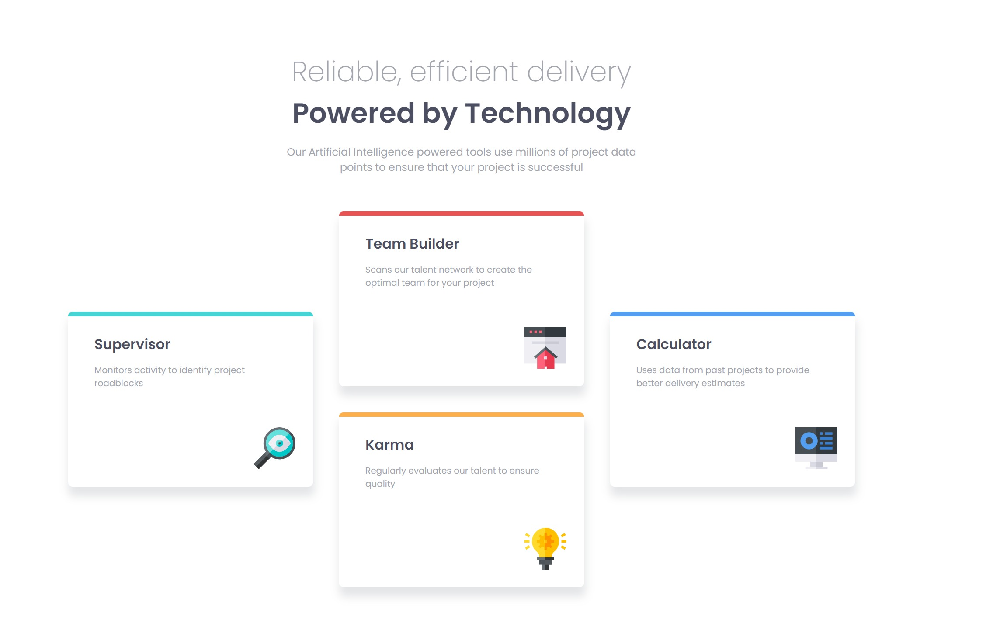

# Frontend Mentor - Four card feature section solution

This is a solution to the [Four card feature section challenge on Frontend Mentor](https://www.frontendmentor.io/challenges/four-card-feature-section-weK1eFYK). Frontend Mentor challenges help you improve your coding skills by building realistic projects. 

## Table of contents

- [Overview](#overview)
  - [The challenge](#the-challenge)
  - [Screenshot](#screenshot)
  - [Links](#links)
- [My process](#my-process)
  - [Built with](#built-with)
  - [What I learned](#what-i-learned)
  - [Continued development](#continued-development)
  - [Useful resources](#useful-resources)
- [Author](#author)

## Overview

### The challenge

Users should be able to:

- View the optimal layout for the site depending on their device's screen size

### Screenshot

### Links

- Solution URL: [Add solution URL here](https://your-solution-url.com)
- Live Site URL: https://CatDraco.github.io/four-card-feature-section/index.html

## My process

### Built with

- Semantic HTML
- CSS Grid
- Mobile-first workflow

### What I learned

I learned that there is more than one way to set up grid and depending on the situation, one method may work better than another.  I found that the method I used for my last project didn't work so well for this one so I had to try a different method.

### Continued development

I would like to continue focusing on HTML/CSS/JS in future projects.

### Useful resources

- [W3 Schools](https://www.w3schools.com/css/default.asp) - This is my favorite resource site for html and css syntax.  
- [Stack Overflow](https://stackoverflow.com/questions/41468951/images-not-displaying-in-github-pages) - This post helped me figure out why my images weren't loading from GitHub Pages.  It turns out that I was using a relative path, but starting the URL with "./" instead of just "/" resolved the issue.

## Author

- Frontend Mentor - [@CatDraco](https://dev.to/catdraco)

